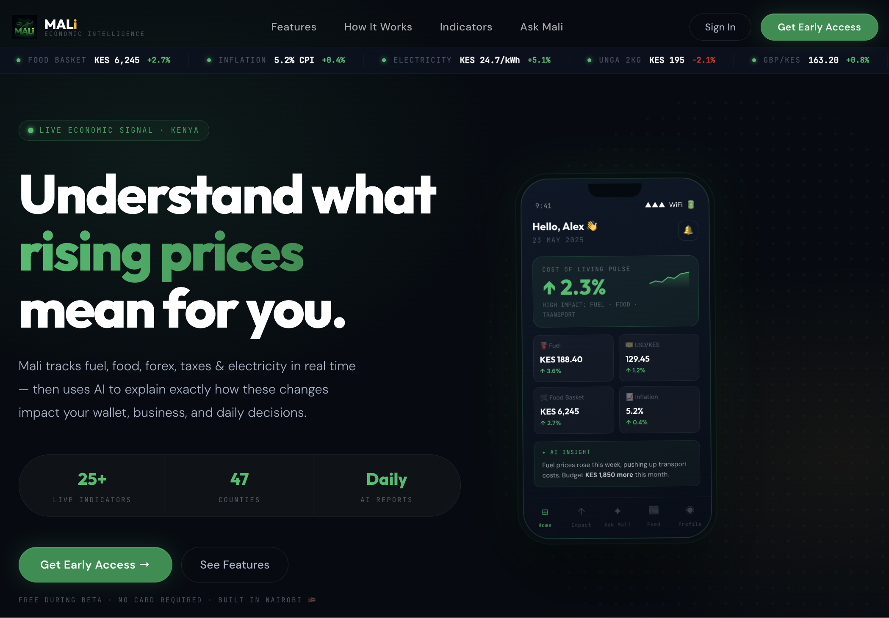

# Mali Website



Mali is a live economic signal platform designed specifically for Kenyans. It tracks crucial economic indicators—such as fuel prices, forex rates (USD/KES), food basket costs, inflation, and electricity tariffs—in real time. The platform leverages AI to analyze these data points and provide personalized insights, explaining exactly how macroeconomic changes impact your wallet, business, and daily decisions.

## 🚀 Features

- **Real-Time Economic Ticker:** Live updates on essential indicators including Super Petrol, Diesel, USD/KES exchange rates, and inflation figures.
- **AI-Powered Insights (Ask Mali):** Understand the "why" behind the numbers. Mali translates raw economic data into actionable, easy-to-understand advice for personal budgeting and business planning.
- **Comprehensive Tracking:** Monitors over 25 live indicators across 47 counties.
- **Interactive Dashboard UI:** Features a sleek, modern interface with dynamic animations to visualize data intuitively.
- **Responsive Design:** Fully functional and visually appealing across both desktop and mobile devices.

## 🛠️ Tech Stack

- **Frontend Framework:** [React 18](https://reactjs.org/)
- **Styling:** Vanilla CSS & Inline Styles (utilizing CSS Variables for theming and dark mode)
- **Typography:** Modern fonts via Fontsource (Plus Jakarta Sans, DM Sans, Outfit)
- **Build Tool:** Create React App (`react-scripts`)

## 📦 Getting Started

Follow these instructions to set up the project locally for development and testing.

### Prerequisites

- [Node.js](https://nodejs.org/) (v16 or higher recommended)
- npm or yarn package manager

### Installation

1. **Clone the repository:**
   ```bash
   git clone <repository-url>
   cd Mali-Mind-Website
   ```

2. **Install dependencies:**
   ```bash
   npm install
   # or if using yarn
   yarn install
   ```

### Running the Application

To start the development server, run:

```bash
npm start
# or
yarn start
```

This runs the app in development mode. Open [http://localhost:3000](http://localhost:3000) to view it in your browser. The page will reload when you make changes, and you may also see any lint errors in the console.

### Building for Production

To build the app for production, run:

```bash
npm run build
# or
yarn build
```

This builds the app for production to the `build` folder. It correctly bundles React in production mode and optimizes the build for the best performance. The build is minified and the filenames include the hashes.

## 🤝 Contributing

This project is currently in early access/beta. For feedback or contributions, please reach out or open an issue in the repository.